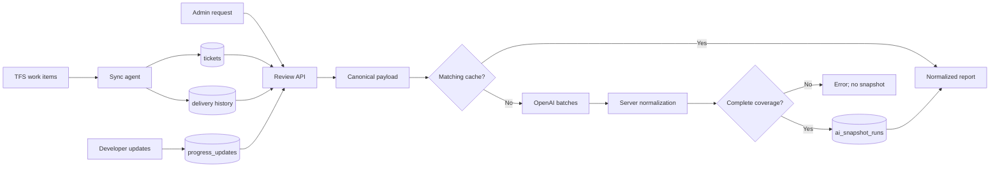

# Standup AI Review: Workflow and Report Source of Truth

**Status:** Implemented

**Policy/cache version:** `standup_review_v21`

**Last implementation review:** August 20, 2026

**Audience:** PMs, Team Leads, administrators, developers, QA, and maintainers

**Primary implementation:** [API](api/server-pg.js), [delivery policy](api/standup-review-delivery.js), [identity policy](api/standup-review-identity.js), [reliability helpers](api/standup-review-reliability.js), and [web UI](web/index.html)

## 1. Executive Definition

Standup AI Review is an administrator-only, on-demand pre-standup report for active, developer-owned Bugs and Product Backlog Items. It compares the assigned developer's current update with that developer's latest prior update, applies workflow and delivery policy, assigns exactly one primary category to every eligible ticket, and produces separate Team Lead and PM follow-up queues.

The feature is intentionally **advisory**. It organizes evidence and recommends questions or actions; it does not change tickets, judge employee performance, replace a standup conversation, or make a management decision.

The report is a hybrid:

- OpenAI interprets free-text progress, blockers, dependencies, ambiguity, and same-day reforecast explanations.
- The API is authoritative for scope, developer identity, dates, missing/incomplete updates, movement, priority/severity, workflow ownership, Expected Delivery, category overrides, coverage, counts, exception lists, escalation queues, and the final summary.

`classifications` in the normalized API response is the source of truth. All summary counts and action lists are rebuilt from it.

## 2. Why the Feature Exists

The feature addresses five recurring pre-standup problems.

1. **Evidence is fragmented.** State, priority, severity, today's update, the prior update, and Expected Delivery are assembled into one ticket view.
2. **Free text is inconsistent.** AI interprets whether a note describes progress, a blocker, dependency, rework, or delivery impact.
3. **Escalation needs consistent policy.** Server rules prevent a language model from independently deciding when Team Lead or PM action is required.
4. **Workflow ownership matters.** Work waiting for QA, release, or review must not be treated as a developer's missing update.
5. **Forecasts need context.** Expected Delivery is evaluated with the update, prior forecast, and workflow stage.

The intended result is faster, more focused standup preparation: administrators can find tickets needing a question, technical decision, or management action without manually re-reading every update.

## 3. Goals and Non-Goals

### Goals

- Cover every eligible ticket, with one primary outcome per ticket.
- Preserve overlapping diagnostics as sub-tags and exception lists.
- Separate Team Lead work from PM work.
- Treat workflow handoff and developer completion correctly.
- Detect missing/incomplete updates, no movement, and state/code mismatch.
- Evaluate Expected Delivery as a mutable development-complete forecast.
- Retain dated, policy-version-aware snapshots.
- Keep results advisory and traceable to ticket-level evidence.

### Non-goals

- This is not an employee score, productivity ranking, or performance-review input.
- It does not predict a date; it evaluates the developer-provided forecast.
- It does not modify TFS or progress-update data.
- It does not replace direct verification or the standup discussion.
- It does not attribute QA or release waiting time to a developer after handoff.
- It does not send email automatically. An administrator may explicitly send the current review's role-scoped notification digests.
- It is not scheduled; an administrator must request it.

## 4. Actors, Access, and Entry Points

| Actor or system | Responsibility |
| --- | --- |
| Developer | Owns the progress update and Expected Delivery forecast in TFS. |
| TFS sync agent | Imports ticket metadata and Expected Delivery. |
| Administrator | Opens or refreshes the review and coordinates follow-up. |
| Team Lead | Resolves technical, workflow, scope, review-owner, or update-quality questions. |
| PM | Handles delivery, priority, release, dependency, and cross-team visibility. |
| OpenAI | Interprets supplied text within the prompt and response contract. |
| API normalizer | Enforces authoritative policy and constructs the report. |

### User interface

- Current review: **Pre-Meeting Updates > Standup AI Review**.
- Force refresh: the adjacent control sends `refresh=1`.
- History: **Reports > Standup AI Review History**.
- The UI hides these controls unless `window.__role` is `admin`.

### API

- Current: `GET /api/ai/standup-review`
- Forced: `GET /api/ai/standup-review?refresh=1`
- Explicit notifications: `POST /api/ai/standup-review/notifications`
- History index: `GET /api/ai/standup-review/history`
- History detail: `GET /api/ai/standup-review/history?date=YYYY-MM-DD`

Every path requires authentication and a database role of exactly `admin`. Server authorization remains authoritative if the UI is bypassed.

Generation is Monday-Friday according to `APP_TZ` (default UTC). History remains readable on weekends.

## 5. System and Data Flow



Successful generation atomically records the daily escalation-policy run, correction observations, and normalized snapshot, followed by best-effort snapshot pruning. Tickets and progress updates are read, not changed. Email is a separate, explicit administrator action after the current review is rendered.

## 6. End-to-End Workflow

1. **Resolve date.** The API uses the database clock and `APP_TZ`. Saturday/Sunday returns HTTP `409 non_working_day`. Previous workday skips weekends, not company holidays.
2. **Read one consistent input snapshot.** The prior boundary, eligible tickets, delivery history, and progress evidence are read in a short read-only `REPEATABLE READ` transaction. The newest earlier `_team_standup` snapshot defines the Expected Delivery change window. With no earlier snapshot, no reforecast is inferred.
3. **Select tickets and canonical owners.** Eligibility is defined in section 7. Exact email assignment wins; `domain\alias` can match an email local part.
4. **Load developer evidence.** For each ticket, load the assigned developer's latest row today and latest row before today. PM/admin/lead/other-developer rows cannot satisfy or replace it. The prior row need not be from yesterday.
5. **Load forecast context.** Load current Expected Delivery and audit events observed since the prior review. The earliest prior value in that window is compared with the current value.
6. **Build payload.** Sanitize titles/notes, limit notes to 300 characters, and calculate delivery context.
7. **Hash and check cache.** SHA-256 covers the ordered complete payload. Reuse requires the same date, v21, hash, and a snapshot younger than 30 minutes; `refresh=1` bypasses ordinary reuse.
8. **Coalesce and call OpenAI.** Identical in-flight work shares one process promise and one cross-instance PostgreSQL advisory lock. Split all tickets into batches of 25, with at most two calls in flight. The configured model (default `gpt-4o-mini`) receives a minimized semantic-signal contract; the server derives summaries, queues, exceptions, and counts.
9. **Normalize.** Merge AI results, then iterate the full payload. Canonical identity/date fields replace AI values; server rules set overrides and derive every secondary list and count.
10. **Verify coverage.** Eligible and reviewed IDs must be non-empty, unique, equal in count, and equal as sets.
11. **Store and render.** Cache the normalized result, bulk-upsert escalation observations, attach server-derived notification counts, and render it in the UI.

If the AI omits one ticket but returns a usable classifications array, normalization creates a conservative fallback, normally Team Lead clarification with an incomplete-output reason. A post-normalization coverage mismatch fails rather than storing a partial report.

## 7. Eligibility, Ownership, and Canonical Input

A ticket is eligible only when:

- It is not soft-deleted and its state is neither Done nor Removed.
- Type is Bug or Product Backlog Item.
- Assignment is nonblank and resolves to a registered `users.role = dev` account.

There is **no iteration, area, or team filter** in this endpoint. Unresolvable assignments are omitted from eligibility, not reported as data-quality exceptions.

Canonical fields sent for each ticket:

| Field | Meaning |
| --- | --- |
| `ticket_id`, `title`, `type`, `state` | TFS identity/workflow metadata; title is sanitized. |
| `assigned_to`, `assigned_developer_email` | Display assignment and canonical account used to select updates. |
| `priority`, `severity`, `state_change_date` | Impact and state-age evidence. Severity is used only for Bugs. |
| `review_date`, `previous_workday_date` | Local review date and prior Monday-Friday date. |
| `today_code`, `today_note`, `has_today_update` | Latest assigned-developer evidence today; note is sanitized/truncated. |
| `prev_code`, `prev_note`, `prev_date` | That developer's latest earlier evidence. |
| `expected_delivery_date` | Current development-complete forecast. |
| `previous_expected_delivery_date`, `expected_delivery_changed` | Forecast before the first observed change since the prior review and whether a change occurred. |
| `reforecast_direction` | `later`, `earlier`, `set`, `cleared`, or `unchanged`. |
| `delivery_date_status` | Server-derived forecast state, including `paused` for On-Hold. |
| `working_days_to_expected_delivery` | Signed Monday-Friday distance from review date; null while On-Hold. |

All fields participate in the input hash. Sanitization performs limited pattern-based secret redaction and replaces common prompt-injection wording; it is not comprehensive data-loss prevention.

## 8. Progress and Workflow Rules

| Code family | Meaning | Review use |
| --- | --- | --- |
| `100_xx` | Starting work | Analysis, setup, codebase review. |
| `200_xx` | In progress | Exact repeat without meaningful note change can be No Movement. |
| `300_xx` | Testing/debugging | Exact repeat without meaningful note change can be No Movement. |
| `400_xx` | Code/peer review | Submitted, addressing feedback, or awaiting approval. |
| `500_xx` | Completion/handoff milestone | `500_01` means checked in and pending or undergoing Sandbox validation; the code alone does not prove development completion. |
| `600_xx` | Challenge | Text determines whether blocked/at risk. |
| `700_xx` | Investigation | Root-cause or solution exploration. |
| `800_xx` | Delay | Explicit current risk and adds `Delayed`, except that On-Hold accepts it as the compatible pause code without escalation by itself. |

The `600_xx`, `700_xx`, and `800_xx` families describe exception or status conditions, not later positions in a linear workflow. Moving from one of those families to `100_xx`, `200_xx`, or `300_xx` is not backward movement by itself.

No current developer update is required in New, Approved, On-Hold, Shelved, Resolved, Ready for QA, QA Testing, or Done. `Branch Checkin` is the exact TFS state value and is exempt only on the local calendar date it entered that state. Beginning the next workday, the assigned developer must provide a current Sandbox-status note. Done and Removed are excluded from live selection.

Exempt tickets without today's update become On Track with a server-derived state tag: New adds `New`; Approved adds `Pending Development`; On-Hold adds `On Hold`; Shelved adds `Awaiting Routine Review`; Resolved/Ready for QA/QA Testing add `Ready for QA`; and Done adds `Done`. The Done tag describes only the TFS state and does not imply release to QA or production. Branch Checkin always adds `Sandbox Validation`; no update or a blank-note `500_01` is tolerated only on its transition date. Explicit blockers, rework, or delivery impact remain actionable.

On-Hold is an **incomplete managed pause**, not a completion state and not the same as Shelved. While it remains active, the server suppresses missing/incomplete-update and No Movement diagnostics, accepts `800_xx` without adding `Delayed` or escalating from the code alone, preserves the existing Expected Delivery with status `paused`, and removes delivery/reforecast follow-up questions. A current note can still reach PM when it explicitly carries Release Risk, Schedule Risk, Delivery Risk, or Cross-Team Dependency. Waiting-for or Delayed tags and `800_xx` alone are not sufficient On-Hold escalation evidence.

Diagnostics in states that require updates:

| Condition | Diagnostic/default handling |
| --- | --- |
| No assigned-developer row today | `No Daily Update`; starts as Missing Update. |
| Row exists, blank code | `Missing Progress Code`; begins as Tier 1 developer correction unless an immediate-risk rule applies. |
| Row exists, blank note | `Missing Notes`; begins as Tier 1 developer correction unless an immediate-risk rule applies. |
| Same exact `200_xx` or `300_xx` and no meaningful note change | `No Movement`. |
| Prior `400_xx` or `500_xx` moves to an active code supported by the current TFS state | `Returned to Active Development`; Team Lead workflow clarification, not a developer correction. Supported pairs are Approved + `100_xx`, Committed + `100_xx`/`200_xx`, In Development + `200_xx`/`300_xx`, and Re-Opened + `200_xx`. |
| Prior `400_xx` or `500_xx` moves to `100_xx`, `200_xx`, or `300_xx`, but the current TFS state does not support that code | `Wrong or Mismatched Progress Code`. |
| Re-Opened with `500_xx` and a blank/whitespace-only current assigned-developer note | `Wrong or Mismatched Progress Code`; any nonblank same-day note satisfies the supporting-note exception. |
| In Development or Code Review with `500_xx` | Stable correction key `Wrong or Mismatched Progress Code`, displayed as `TFS State May Need Advancement`. |
| Branch Checkin note explicitly reports Sandbox passed | Same stable correction key and display label; action targets `Resolved` for a Bug or `Ready for QA` for a PBI. |
| Code conflicts with TFS state | `Wrong or Mismatched Progress Code`. |

Persistent no-update requires that the current state existed on/before the preceding weekday and that the assigned developer also lacked an update that weekday. Monday uses Friday.

### Update-quality sufficiency

The current note is evaluated together with the ticket title, TFS state, and progress code. The title supplies the work-item scope, so the developer does not need to repeat the feature, module, or defect name in every update.

A usable update states the current status or outcome and the next executable work activity. A concrete ongoing activity such as debugging, testing, implementing, investigating, validating, reviewing, reproducing, fixing, or submitting can satisfy the activity requirement. When the note reports no progress, delay, or a blocker, it must also identify the reason, dependency, or constraint and the next intended activity. Exact test cases, debugging hypotheses, code locations, and implementation details are optional unless needed to understand a blocker, requested decision, or workflow handoff.

`Vague Update` is proposed by the AI but accepted only after server normalization. The server removes it for workflow-exempt or more-specific missing-update cases and for high-confidence sufficient notes. If the removed vague tag was the model's only actionable concern, its Team Lead category, reason, and action are discarded before deterministic workflow and delivery rules run. Update quality is independent from priority, severity, and Expected Delivery. Repeated text is evaluated separately as `No Movement`.

Examples:

- Sufficient: “No progress was made because build-release tickets were prioritized. Will continue debugging and testing today.”
- Sufficient: “Currently testing the bug fixes in the local environment.”
- Vague: “Working on it.”, “No progress yesterday.”, or “Will continue.”

## 9. Priority and Severity

- P1/P2 plus Blocked, no update, or No Movement becomes PM escalation.
- P1/P2 submitted-but-incomplete updates remain Team Lead-first unless the current update shows explicit delivery impact.
- Bug severity Critical/High adds a visibility tag but never escalates alone.
- For P3/P4 Critical/High Bugs, Blocked or No Movement becomes PM escalation.
- The first missed required weekday for those Bugs goes to Team Lead; a consecutive miss goes to PM with `Persistent Missing Update`.
- PBIs ignore severity, even when a value exists.
- Workflow exemptions take precedence over severity.

## 10. Expected Delivery Policy

Expected Delivery is the developer's mutable estimate of **development completion**. It is not a Resolved, Closed, release, QA-complete, or deployment date.

It is required in In Development, Code Review, Branch Checkin, and Re-Opened. In other incomplete states it is optional, and an existing date is normally still evaluated. On-Hold is the exception: its existing date is preserved but paused until work resumes. Development completion is state-based: Resolved, Ready for QA, QA Testing, or Done. A `500_xx` code, Branch Checkin, Shelved, or On-Hold does not independently prove completion.

| Status | Interpretation |
| --- | --- |
| `not_required` | Blank and not required in this state. |
| `paused` | Ticket is On-Hold. The stored date is preserved, but no working-day countdown or due/overdue evaluation applies. |
| `missing_required` | Blank in In Development, Code Review, Branch Checkin, or Re-Opened. |
| `scheduled` | More than two working days away. |
| `due_soon` | After today and within two Monday-Friday days. |
| `due_today` | Equals review date. |
| `overdue` | Before review date while development is incomplete. |
| `development_complete` | Current TFS state is Resolved, Ready for QA, QA Testing, or Done. |

Weekend target dates use the actual date for due-today/overdue comparison; working-day distance excludes weekends.

Policy application:

1. Missing required dates go to Team Lead unless Blocked/PM is already stronger.
2. Healthy due-soon/due-today work can remain On Track.
3. Near-term plus Blocked, no update, or No Movement goes to PM.
4. Near-term plus incomplete/mismatched evidence stays Team Lead-first unless explicit delivery impact exists.
5. First-working-day overdue with usable progress goes to Team Lead for a refreshed forecast.
6. Overdue plus Blocked, no update, No Movement, explicit impact, or persistence goes to PM.
7. Overdue Code Review waiting on a reviewer is a Team Lead queue issue unless today's note identifies developer rework.
8. Active-state or Branch Checkin `500_xx` remains incomplete for date policy until TFS reaches a development-complete state.
9. On-Hold forces `paused`, a null working-day countdown, and `unchanged` reforecast direction. Due, overdue, missing-date, and reforecast-rationale diagnostics resume when the ticket returns to an active state.

### Reforecast policy

| Direction | Handling |
| --- | --- |
| `set` | Previously blank, now populated; no rationale assessment. |
| `cleared` | Previously populated, now blank; missing if required. |
| `earlier` | Informational; adds Reforecasted without escalation alone. |
| `later` | Adds Reforecasted and requires same-day rationale assessment. |
| `unchanged` | No observed material change. |

Only the assigned developer's sanitized same-day note can support a later reforecast. Prior notes, PM/lead annotations, TFS System.Reason, and unstated context do not count.

The AI proposes:

- `reforecast_explanation_status`: Supported, Missing, Ambiguous, or Not Applicable.
- `reforecast_reason_type`: Blocker, Scope Change, Investigation Finding, Unexpected Complexity, Dependency, Environment or Access, Other Supported Reason, or None.
- `reforecast_evidence`: a short exact excerpt from today's note.

The server accepts Supported only when the excerpt occurs in the sanitized note and the reason type is allowed/non-None. Blank notes become Missing; other unverifiable claims become Ambiguous. Unsupported later changes add `Reforecast Needs Rationale`, route to Team Lead unless a stronger outcome applies, and add a question when the five-question cap allows. Reforecasting alone never creates PM escalation. While On-Hold, reforecast direction is normalized to `unchanged` and delivery/reforecast questions are removed; the forecast is validated again after the ticket resumes.

## 11. Category Resolution

Each ticket has exactly one primary category.

| Category | Meaning/default action |
| --- | --- |
| On Track | Normal progress or valid handoff; normal review only. |
| Blocked | Cannot proceed without outside action; confirm blocker owner/path. |
| Missing Update | Required current update is absent; obtain it. |
| Needs Team Lead Clarification | Technical, workflow, scope, code/note, review-owner, or forecast question. |
| Needs PM Escalation | Priority, persistence, delivery, release, or cross-team impact needs management visibility. |

Practical precedence:

1. Valid workflow exemptions force On Track unless permitted current risk exists.
2. Missing, incomplete, delayed, no-movement, backward-movement, and mismatch rules establish deterministic baselines.
3. AI-only PM escalation is downgraded to Team Lead unless the current update has a recognized explicit-risk signal.
4. P1/P2 and Critical/High Bug rules can promote to PM.
5. Expected Delivery can add Team Lead review or promote adverse near-term/overdue work to PM.
6. Stronger Blocked or PM outcomes survive a missing date or unsupported reforecast that would otherwise be TL-first.

Explicit current delivery risk normally requires a current update and a recognized tag (Release/Schedule/Delivery Risk, Cross-Team Dependency, Waiting for Access/Data/Decision/Environment, or Delayed); current `800_xx` also normally qualifies. For On-Hold, the current note must explicitly support Release Risk, Schedule Risk, Delivery Risk, or Cross-Team Dependency. The code, Delayed, and Waiting-for tags alone do not qualify.

### Tiered action ownership

Primary categories remain unchanged for snapshot compatibility, but the additive `escalation` object is authoritative for action ownership and notification queues.

- Tier 1: the first reviewed-day occurrence of a routine developer correction is developer-owned.
- Tier 2: the same correction on the next completed reviewed workday is Team Lead-owned and appears on the PM watchlist.
- Tier 3: the same correction on a third completed reviewed workday becomes a formal PM escalation while remaining visible to the Team Lead.
- Blockers and material priority, delivery, schedule, release, or cross-team risks bypass persistence and route immediately to the appropriate manager tier.

Correction streaks are tracked independently per ticket, canonical developer, and correction key. Missing review days pause a streak; a completed review without the correction resolves it; a developer ownership change resets it. Same-day refreshes replace the day's observation and never increment the streak.

## 12. Generated Report: Sections and Interpretation

The browser renders the normalized response in this order.

### 12.1 Header and coverage

The header shows review date, cached status, and coverage. History also shows `v21 · Current policy`, an older version as Previous policy, or Legacy.

A cached report means date, policy version, and complete canonical input matched a result from the last 30 minutes. It is not necessarily stale. Historical versions must be interpreted under their own policy.

### 12.2 Standup Summary

The final summary is built by the server, even though AI supplies a draft. It includes:

- On-track versus total.
- Counts for Blocked, Missing, Needs TL, and Needs PM.
- Critical On Track visibility when present.
- A forecast sentence when relevant.
- At most the first two non-On-Track items in normalized ticket order.

Use it for orientation, not as the complete risk list.

### 12.3 Ticket Counts

| Tile | What it counts |
| --- | --- |
| Total | All eligible normalized classifications. |
| On Track / Blocked / Missing / Needs TL / Needs PM | Tickets whose **primary category** is that value. |
| Delayed | Has `Delayed`, normally current `800_xx`; managed On-Hold suppresses this code-only diagnostic. |
| Ready QA / Ready Release | Has the corresponding workflow tag. |
| Overdue / Due Today / Due Soon | Has that delivery status. |
| Forecast Missing | Status is `missing_required`. |
| Later Reforecast | Direction is `later`; earlier changes do not increment it. |
| Tier 1 / Tier 2 / Tier 3 | Effective developer, Team Lead, or PM action owner after persistence and bypass rules. |
| PM Watch | Tier 2 tickets visible to PM for monitoring but not formal action. |

The five primary category tiles are mutually exclusive and sum to Total. Diagnostic tiles overlap.

Critical interpretation examples:

- A P1 no-update ticket counts under Needs PM, not Missing, but still appears in Missing Updates exceptions.
- A Critical Bug with No Movement may count under Needs PM, not Needs TL.
- A due-soon On Track ticket increments both On Track and Due Soon.
- Forecast Missing can coexist with Needs PM when a stronger PM rule wins.

Do not use Blocked or Missing tiles alone to estimate all blocker/missing evidence; use sub-tags and exceptions.

### 12.4 Ticket Classifications

Tickets are grouped by developer. Developers with the highest-attention category appear first, then alphabetically. Within each developer:

1. Category: Needs PM, Blocked, Missing, Needs TL, On Track.
2. Delivery urgency: overdue, due today, missing required, due soon, scheduled, then paused/complete/not required.
3. Numeric ticket ID, then lexical ID.

| Column | Interpretation |
| --- | --- |
| ID | Canonical TFS ID. |
| Title | AI-returned title when present, otherwise sanitized canonical title. |
| Code | Today's code, or latest prior code when today is absent. A displayed prior code is not proof of today's update. |
| Expected Delivery | Canonical current forecast or dash. |
| Forecast Status | Badges for overdue, due today/soon, missing, paused (`Delivery Paused`), and earlier/later reforecast. Scheduled/complete/not-required render as dash. |
| Update Summary | AI summary or sanitized current note; exempt rows may fall back to a labeled prior note. |
| Category | Single normalized primary outcome. |
| Escalation | Effective tier/action owner, persistence day, and whether routing bypassed the normal ladder. |
| Sub-tags | Overlapping evidence and diagnostics. |
| Reason | Highest-precedence server reason, otherwise AI explanation; validated reforecast detail appears beneath it. |
| Recommended Action | Highest-precedence deterministic action, otherwise AI/category fallback. |

The API classification also carries canonical `developer_email`, `previous_expected_delivery_date`, `delivery_date_status`, `working_days_to_expected_delivery`, `reforecast_direction`, `reforecast_explanation_status`, `reforecast_reason_type`, `reforecast_evidence`, `sandbox_validation_status`, `sandbox_validation_evidence`, and optional state-advancement target/action metadata.

### 12.5 Sub-tags

Sub-tags overlap and do not replace the category.

| Group | Tags |
| --- | --- |
| Update quality | No Daily Update, Missing Progress Code, Missing Notes, Vague Update, No Movement |
| Workflow | Returned to Active Development, Wrong or Mismatched Progress Code, New, Pending Development, On Hold, Sandbox Validation, Ready for QA, Awaiting Routine Review, Done, Review Queue Risk |
| Progress/risk | Normal Progress, Delayed, Possible Risk, Release Risk, Schedule Risk, Delivery Risk |
| Dependency | Waiting for Access/Data/Decision/Environment, Cross-Team Dependency |
| Impact | Critical Severity, High Severity, Persistent Missing Update |
| Forecast | Expected Delivery Missing/Overdue/Reforecasted, Delivery Due Soon/Today, Reforecast Needs Rationale |

`Delivery Paused` is a forecast-status badge derived from `delivery_date_status=paused`; it is not a sub-tag or a separate count tile.

The server adds deterministic tags and retains prompted AI semantic tags, with three controlled exceptions. `Returned to Active Development` and `Wrong or Mismatched Progress Code` are removed from AI output and re-added only when deterministic progress-code rules match. `Vague Update` is removed and re-added only when the note is not workflow-exempt, has no more-specific missing-update correction, and does not match a high-confidence sufficient-update form. A compatible workflow return is routed to Team Lead clarification and excluded from developer correction notifications. For workflow-exempt tickets, AI tags are first limited to `Normal Progress`; the server then adds the authoritative state tag. On-Hold always adds `On Hold`, including when explicit material risk makes the ticket actionable. Authoritative severity/delivery tags can also be added. `Normal Progress` is removed when the final outcome conflicts with it.

### 12.6 Exceptions

Each entry contains ticket ID, developer, and issue. Lists are diagnostic and can overlap.

| List | Inclusion |
| --- | --- |
| Missing Updates | Primary Missing Update or `No Daily Update`. |
| Vague or Incomplete | Vague, missing code/note/date, or unsupported reforecast. |
| Blocked | Primary category Blocked. |
| Delayed / At-Risk | Any configured delay, no-movement, priority-risk, dependency, forecast-urgency, persistent-miss, or review-queue tag. |
| Needs Team Lead Clarification | Primary category Needs TL. |
| Needs PM Escalation | Primary category Needs PM. |

Exceptions answer “which tickets show this diagnostic?” Primary counts answer “what is each ticket's single highest outcome?”

### 12.7 Follow-Up Questions

Each item has ticket ID, developer, reason, and a draft question. AI questions are kept only for known tickets, removed for exempt no-update cases, and blocked from asking delivery questions after development completion or while delivery is paused by On-Hold. The server adds a question for an unsupported later reforecast. The final list is capped at five.

An empty list means no qualifying ambiguity was identified, not that discussion is prohibited.

### 12.8 Team Lead Review Items

Each row has ticket/developer, tier, persistence days, issue, why TL is needed, and suggested action. Inclusion occurs for immediate Lead concerns and Tier 2 or Tier 3 repeated corrections. Routine Tier 1 corrections do not enter this queue.

A Needs PM ticket can also appear here because inclusion uses tags. Interpretation: PM owns delivery/coordination risk while TL owns the supporting technical, workflow, or forecast-quality action.

### 12.9 PM Watch Items

Tier 2 repeated corrections appear here for monitoring while the Team Lead owns the current action. Watch items are labeled separately and do not increment formal PM escalation counts.

### 12.10 PM Escalation Items

Immediate PM-risk tickets and Tier 3 repeated corrections appear. Rows include issue, concise evidence, delivery risk, and recommended PM action.

Risk text prioritizes overdue/due-today, then due-soon, persistent Critical/High misses, severity with current risk, P1/P2 risk, release risk, delay/dependency, then generic visibility. Current normalized fallbacks begin with `High -` or `Medium -`.

`evidence` is concise report text, not an audit-grade quotation. Verify it against TFS and direct observations.

### 12.11 Advisory footer

Every report states: “This review is AI-generated and advisory. Verify against direct observations before acting.” This is a usage requirement.

### 12.12 Explicit Email Notifications

The current review, but not history, provides three administrator-only actions. Generating, loading, caching, or force-refreshing a review never sends email.

Button item counts are derived by the server from the same correction and escalation policy used for routing. The browser does not maintain a duplicate correction-tag list.

- **Email Team Leads** sends each verified lead only the Team Lead review items for developers with the same nonblank `users.team`. Items with a blank team or no verified matching lead are sent to verified PM users as a fallback in the same operation.
- **Email PMs** sends one digest with separate **Action required** and **Watch only** sections individually to every verified PM except PM users assigned to the `qa` team. Watch items do not imply PM ownership. Team Lead fallback items are not included in this action.
- **Email Developers** sends each affected verified developer only their own correction items: missing daily update/code/notes, vague update, code-state mismatch, missing Expected Delivery, or unsupported reforecast rationale. It excludes category labels and lead/PM-only commentary.

Each button submits the displayed `date` and `input_hash`. The API accepts only today's latest current-policy snapshot and recomputes the canonical live input hash before sending; changed ticket or progress data requires a refresh. Identical recipient content is recorded and sent once. Failed rows and expired `sending` leases can be retried. A delivery that succeeded but could not be finalized in the ledger is recorded as `unknown_delivery` when possible and is not retried automatically. One recipient's failure does not invalidate the review or stop other recipients.

The delivery ledger records logical recipients even when `TEST_RECIPIENT` redirects mail. Messages use individual `To` recipients without role-wide CC lists.

## 13. API Response Shape

```json
{
  "cached": false,
  "date": "YYYY-MM-DD",
  "standup_summary": "...",
  "classifications": [],
  "exceptions": {
    "missing_updates": [],
    "vague_or_incomplete": [],
    "blocked": [],
    "delayed_at_risk": [],
    "needs_tl_clarification": [],
    "needs_pm_escalation": []
  },
  "follow_up_questions": [],
  "tl_review_items": [],
  "pm_watch_items": [],
  "pm_escalation_items": [],
  "validation": {},
  "notification_counts": {
    "lead": 0,
    "pm": 0,
    "developer": 0,
    "pm_action": 0,
    "pm_watch": 0
  },
  "input_hash": "sha256...",
  "coverage": {
    "eligible": 0,
    "reviewed": 0,
    "omitted": 0,
    "complete": true
  }
}
```

Each classification may include additive `progress_code_issue_type` metadata. The value `tfs_state_may_need_advancement` selects the state-advancement display wording while preserving the `Wrong or Mismatched Progress Code` sub-tag and persistence identity. The value `returned_to_active_development` identifies a compatible workflow return and does not create a developer correction observation. Escalation correction entries may include an additive `label`; older snapshots without either field fall back to the correction key.

The current-review response adds runtime `notification_counts`; those counts are not persisted in snapshots. History detail adds `generated_at`, `prompt_version`, and `is_current_version`, and returns `cached: true`. The raw AI response is not stored separately; the normalized result is stored.

## 14. How to Use the Report

1. Confirm date, coverage, cached status, and historical policy version.
2. Read the summary for scale, not as the full action list.
3. Review Needs PM first; verify evidence, owner, impact, and coordination.
4. Review Blocked items and identify the unblock owner/path.
5. Review Missing Updates via the exception list, because promoted misses may not be in the Missing tile.
6. Give TL items to the Team Lead for code/state, technical, review-owner, and forecast-quality resolution.
7. Read forecast badges with category/reason. Due or reforecasted does not automatically mean unhealthy.
8. Adapt and ask the drafted questions.
9. Verify in TFS and conversation before acting.

Common mistakes:

- Due soon is not late; healthy near-term work may be On Track.
- Reforecasted is not automatically escalated.
- An old Expected Delivery on an On-Hold ticket is paused, not overdue; the date remains visible and is revalidated when work resumes.
- Development complete does not mean QA, release, or deployment complete.
- Severity is visibility, not automatic escalation.
- Exception totals overlap and do not add to Total.
- Historical versions are not policy-equivalent.

## 15. Cache, History, and Retention

### Current cache

- Valid 30 minutes for the same date, v21, and exact input hash.
- Force refresh bypasses lookup and stores a new successful snapshot.
- A corrupt matching cache row is ignored and generation proceeds.

### History

- Index returns the newest snapshot per date across all prompt versions.
- Index returns at most `STANDUP_REVIEW_HISTORY_LIMIT` dates, default 90, and reports `has_more` when older dates were omitted.
- Detail returns the newest snapshot for the requested date.
- A version bump prevents old cache reuse but does not hide old history.
- Older snapshots without delivery fields render with safe fallbacks.

### Retention

Successful generation triggers cleanup that keeps one newest snapshot for each of the newest `STANDUP_REVIEW_RETENTION` distinct review dates across prompt versions. The default is 30 dates. Force refreshes replace the retained snapshot for that date instead of consuming another retention slot. Setting retention to `0` disables cleanup. Cleanup is fire-and-forget and does not fail the report.

## 16. Failure Points

| Condition | Behavior |
| --- | --- |
| Unauthenticated / non-admin | Authentication failure or HTTP 403; no report. |
| Weekend | HTTP `409 non_working_day`; no snapshot. |
| Missing OpenAI key | HTTP `501 ai_not_configured`; no snapshot, even for zero eligible tickets. |
| Database or OpenAI batch failure | Entire request fails; no partial successful snapshot. |
| Token-limit truncation | HTTP 500 `response_truncated`; no snapshot. |
| Refused/empty/malformed AI output | `bad_ai_response`; no snapshot. |
| One omitted AI classification | Conservative normalized fallback; coverage may still complete. |
| Post-normalization mismatch | HTTP 500 `standup_coverage_mismatch`; no snapshot. |
| Invalid/missing/corrupt history | HTTP 400/404/500; history not rendered. |
| Retention cleanup fails | Warning only; current report succeeds. |
| Notifications disabled or mail unconfigured | HTTP 503 from the explicit notification endpoint; the review remains available. |
| Displayed review is not today's latest current-policy snapshot | HTTP 409 `stale_review`; refresh before sending. |
| Live ticket/progress data changed after generation | HTTP 409 `stale_review`; refresh before sending. |
| Some recipient deliveries fail | Successful recipients remain sent; the endpoint reports a partial result and failed rows can be retried. |

The UI writes errors beside the controls but does not explicitly clear an already rendered current card after a later refresh failure. Check the status text and displayed date.

## 17. Data Handling and Trust Boundaries

The AI receives ticket ID, sanitized title, type/state, priority, Bug severity, state date, current/prior code-note-date evidence, and Expected Delivery context. Canonical developer identity and repeated per-ticket review dates remain server-side.

Implemented controls:

- Admin-only UI and API.
- Assigned-developer-only evidence.
- Pattern-based title/note sanitization and 300-character note limit.
- Structured JSON response request.
- Deterministic normalization and coverage validation.
- HTML escaping in report rendering.
- Advisory language and no automatic ticket mutation.

Sanitization is not comprehensive DLP. Assume these fields are sent to the configured OpenAI service; secrets do not belong in titles or progress notes.

## 18. Expected Delivery Sync and Audit

The agent reads TFS `SupplyPro.SPApplication.ExpectedDeliveryDate`, normalizes it to `YYYY-MM-DD`, and sends `expectedDeliveryDate`. The API stores it in nullable `tickets.expected_delivery_date`.

`ticket_expected_delivery_history` records ticket ID, prior/current dates, direction, TFS changed timestamp, and observation timestamp.

- An omitted property from an older agent preserves the stored date.
- Explicit null/blank clears it.
- Invalid dates reject sync.
- Only set, clear, earlier, or later changes create history.
- A `where not exists` guard makes identical retries idempotent.
- History begins at deployment; older changes are not reconstructed.

## 19. Configuration and Operations

| Setting | Behavior |
| --- | --- |
| `OPENAI_API_KEY` | Required to generate. |
| `OPENAI_MODEL` | Defaults to `gpt-4o-mini`. |
| `APP_TZ` | Local review date; defaults to UTC. |
| `STANDUP_REVIEW_RETENTION` | Distinct review dates retained, one latest snapshot per date; defaults to 30. Set `0` to disable cleanup. |
| `STANDUP_REVIEW_HISTORY_LIMIT` | Maximum dates returned by the history index; defaults to 90. |
| `STANDUP_REVIEW_EMAILS_ENABLED` | Explicit notification master switch; defaults to false. |
| `STANDUP_NOTIFICATION_LEASE_MINUTES` | Time before an abandoned `sending` notification claim can be reclaimed; defaults to 15 minutes. |
| `TEST_RECIPIENT` | Redirects every To/CC destination during mail testing; the ledger still records the logical recipient. |
| Prompt version | Code constant `standup_review_v21`. |
| Escalation policy | Code constant `standup_escalation_v2`; v2 starts fresh correction streaks under the context-aware vague-update rule. |
| Batch size / concurrency | Code constants 25 / 2. |
| Cache lifetime | Code constant 30 minutes. |

`api/.env.example` documents the notification master switch. Confirm `OPENAI_MODEL`, `APP_TZ`, and retention values directly in deployment configuration when they differ from defaults.

Do not run the TFS agent or production report flow merely to test this document. Use unit tests and a test API/database for integration checks.

## 20. Verification

From `api/`:

```text
npm test
```

Standup tests cover identity, weekday logic, hash/batching/coverage, admin access, handoffs, P1/P2 behavior, Bug severity, On-Hold managed-pause behavior, `800_xx` suppression and explicit-risk escape, delivery status/persistence, resumption validation, Code Review ownership, date auditing, reforecast evidence, derived response integrity, cache/history versions, UI badges/sorting/errors, and legacy snapshot fallbacks.

Suggested integration smoke checks:

1. As admin, generate a weekday review against test data.
2. Confirm complete coverage and that five primary counts sum to Total.
3. Request again unchanged and confirm `cached: true`.
4. Change an update/forecast and confirm the hash changes.
5. Force refresh and confirm a new snapshot.
6. Load history and confirm version metadata.
7. Confirm PM/lead/dev cannot access UI controls or APIs.

## 21. Known Limitations and Open Questions

### Confirmed limitations

- Weekday calculations do not model company holidays.
- Generation is manual, not scheduled.
- Email notification is manual and limited to the current review; there is no scheduled reminder or automatic resend.
- Scope has no iteration, area, or team filter.
- Only Bugs and PBIs are reviewed; Done and Removed are excluded.
- Unresolvable developer assignments are omitted.
- Notes are limited to 300 characters for AI use.
- Reforecast history depends on sync observation and starts at deployment.
- Later reforecasts require enough same-day note detail.
- Non-`800_xx` explicit risk depends on constrained AI tag interpretation. For On-Hold, the allowed material-risk tags are Release Risk, Schedule Risk, Delivery Risk, and Cross-Team Dependency.
- Reliable one-time visibility for a ticket newly entering On-Hold is not implemented because some TFS records, including the investigated #207882 case, have a null `state_change_date`. General `changed_date` is not used as a substitute because unrelated edits can change it.
- The UI has no dedicated report export.
- Holiday rules and the two-day due-soon threshold are not configurable.

### Decisions not yet made

- Should scope be restricted to a current iteration, team, or area?
- Should unresolved assignments appear as data-quality exceptions?
- Should Standup settings be added to `api/.env.example`?
- Should retention count distinct dates rather than snapshot rows?
- Should a failed refresh clear or mark the visible report as old?
- Should company holidays be configured?
- Should an approved export or scheduled snapshot be added?
- After state-change tracking is reliable, should newly On-Hold P1/P2, already-overdue, or explicitly risky tickets receive a one-time PM acknowledgement item?

Until those questions are implemented, this document describes the authoritative behavior.

## 22. Implementation Map and Change Checklist

| File | Responsibility |
| --- | --- |
| [`agent/agent.ps1`](agent/agent.ps1) | Reads/sends TFS Expected Delivery. |
| [`api/expected-delivery-date.js`](api/expected-delivery-date.js) | Sync validation and forecast audit persistence. |
| [`api/standup-review-identity.js`](api/standup-review-identity.js) | Latest update by ticket and canonical developer. |
| [`api/standup-review-delivery.js`](api/standup-review-delivery.js) | Date status, workdays, On-Hold pause behavior, reforecast, completion, persistence, Code Review ownership, rationale validation. |
| [`api/standup-review-reliability.js`](api/standup-review-reliability.js) | Dates, hash, batches, coverage, reusable role check. |
| [`api/server-pg.js`](api/server-pg.js) | Eligibility, prompt, AI call, normalization, policy, cache, retention, API/history. |
| [`api/standup-review-notifications.js`](api/standup-review-notifications.js) | Notification routing, developer-safe corrections, content hashing, email rendering, and delivery-ledger schema. |
| [`api/standup-review-escalation.js`](api/standup-review-escalation.js) | Tier correction keys, persistence schema, streak calculation, escalation metadata, and derived queues. |
| [`web/index.html`](web/index.html) | Controls, errors, rendering, grouping, sorting, badges, footer. |
| `api/standup-review-*.test.js` | Regression coverage. |

When changing the feature:

1. Update deterministic policy and tests first for authoritative rules.
2. Keep the prompt aligned with the normalizer.
3. Bump the prompt version for material policy/prompt changes.
4. Preserve one classification per eligible ticket and derive secondary structures from it.
5. Preserve assigned-developer-only evidence and admin-only access.
6. Verify old snapshots render safely.
7. Update this document in the same change.
